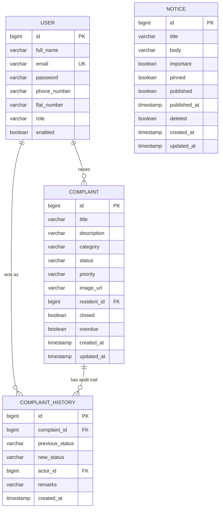

# Resolvo — Society Maintenance Tracker

I built **Resolvo** to solve a real-world challenge: managing and tracking maintenance complaints in residential societies with absolute transparency and efficiency.

Resolvo is a full-stack, production-hardened platform. Residents can self-register, log in, raise maintenance requests (with category, details, and photos), view notice boards, and receive in-app notifications. Admins manage the complaint lifecycle with automatic overdue alerts, prioritize issues manually or let an AI assist them, run a clean notice board, and view real-time aggregated metrics via an interactive dashboard.

This repository is structured as a monorepo containing:
1. **Backend**: Spring Boot 3.3 & Java 21 REST API. Detail notes: [`backend/README.md`](./backend/README.md).
2. **Frontend**: React 19, TypeScript, Vite, Tailwind CSS v4 client. Detail notes: [`frontend/README.md`](./frontend/README.md).

---

## Table of Contents
- [Features](#features)
- [Tech Stack & Integrations](#tech-stack--integrations)
- [System Architecture & Implementation](#system-architecture--implementation)
  - [Basic: Data Flow & Architecture](#basic-data-flow--architecture)
  - [Intermediate: Folder Structure & Package Layout](#intermediate-folder-structure--package-layout)
  - [Advanced Deep Dives](#advanced-deep-dives)
- [Folder Structure Directory Map](#folder-structure-directory-map)
- [ER Diagram](#er-diagram)
- [Interactive API Documentation](#interactive-api-documentation)
- [Environment Configuration](#environment-configuration)
- [Getting Started](#getting-started)
- [Screenshots](#screenshots)
- [Future Roadmap](#future-roadmap)

---

## Features

### Authentication & Access Control
- **Secure Sessions**: Stateless JWT-based registration and login, with BCrypt password hashing.
- **Role-Based Routing**: Strict separation between `RESIDENT` and `ADMIN` roles across endpoints and UI routes.

### Complaint Management
- **Interactive Forms**: Residents raise complaints under categories (e.g., Plumbing, Electrical, Security) and upload optional supporting photos.
- **Enforced Lifecycle**: Complaints progress through a strict state machine (`OPEN` ↔ `IN_PROGRESS` → `RESOLVED`). Once resolved, they are closed permanently.
- **Audit Trails**: Every state change publishes domain events to write a permanent, append-only history trail recording the actor, action, timestamp, and optional remarks.
- **Advanced Search & Filtering**: Admins search and filter complaints on the database level using JPA Specifications (combining category, priority, status, overdue status, date ranges, resident name, and free-text keywords).

### Automatic Overdue Detection
- **Configurable Background Job**: A Spring scheduler runs periodically, identifying unresolved complaints older than a configurable threshold (e.g., 5 days) and flagging them.
- **Domain Event Alerts**: Flagged complaints dispatch overdue events, prompting automated administrative alerts.

### Notice Board
- **Draft & Publish Flow**: Admins draft notices, toggle their visibility (`draft` vs. `published`), pin them to the top of the feed, or soft-delete them.
- **Broadcast Notifications**: Publishing important notices triggers automated emails to every resident.

### Dashboard Analytics
- **Live Aggregations**: Headline counts, monthly trends, and categories/priorities/status distributions are computed via high-performance database aggregation queries, avoiding memory-intensive collection parsing in Java.

### In-App Notifications
- **Real-Time Actions**: A database-backed notifications system captures relevant actions (e.g., complaint status changes, new notices, overdue alerts) and serves them as in-app notification cards.

---

## Tech Stack & Integrations

| Layer / Integration | Technologies & Providers |
|---|---|
| **Language & Backend** | Java 21, Spring Boot 3.3.x, Maven |
| **Persistence & DB** | PostgreSQL, Spring Data JPA / Hibernate, HikariCP |
| **Security & Auth** | Spring Security, JJWT (JWT), BCrypt |
| **Frontend Framework** | React 19, Vite, TypeScript |
| **Styling & Components** | Tailwind CSS v4, Radix UI Primitives, Lucide React, next-themes |
| **State Management** | Axios, TanStack Query v5 (React Query), React Hook Form, Zod |
| **Charts & Visuals** | Recharts |
| **Image Hosting** | Cloudinary API |
| **Email Service** | SendGrid API (SMTP) |
| **AI Processing** | Groq API (Llama models) |
| **Scheduling & Metrics** | Spring Scheduled Task Scheduler, Spring Boot Actuator |

---

## System Architecture & Implementation

### Basic: Data Flow & Architecture
At a basic level, Resolvo works by linking a responsive frontend interface to a RESTful API backend:
1. The **Vite Frontend Client** (running on port `5173`) runs in the user's browser. It communicates with the backend via Axios.
2. The **Spring Boot Backend API** (running on port `8080`) processes incoming HTTP requests, performs security checks, executes business logic, and saves data to a local or remote **PostgreSQL Database**.
3. For media upload, the frontend submits the image file to the backend, which uploads it to the Cloudinary API, receives a secure image URL, and persists only that URL in the database.
4. For email dispatch, the backend connects securely to a SendGrid server to send HTML notifications.

### Intermediate: Folder Structure & Package Layout
I structured this project using a **feature-based package layout** on the backend and a **modular feature layout** on the frontend, departing from standard folder structures grouped by technological layer.

- **Backend Feature Packaging**: Instead of grouping all controllers, services, and repositories in separate directories, everything related to a specific domain domain object (e.g., `auth`, `complaint`, `notice`, `notification`, `dashboard`) sits inside its respective package. This ensures high cohesion.
- **Frontend Modular Features**: The React application separates concerns using custom layouts, context providers (like auth and themes), reusable hooks, and a directory layout inside `features/` that groups forms, components, and pages.

### Advanced Deep Dives

#### 1. Enforced Lifecycle State Machine
I built a dedicated state manager, [ComplaintStateMachine](file:///d:/resolvo/resolvo/backend/src/main/java/com/resolvo/backend/complaint/ComplaintStateMachine.java), to ensure no complaint transitions illegally (e.g., moving straight from `OPEN` to `RESOLVED` without a work log, or editing a closed complaint). The allowed transitions are:
* `OPEN` ↔ `IN_PROGRESS`
* `IN_PROGRESS` → `RESOLVED`

Any attempt to trigger an illegal status update returns a validation exception handled globally, returning a standard error schema to the client.

#### 2. Decoupled Side Effects via Spring Application Events
To prevent services from becoming bloated with unrelated side effects (like sending emails or recording audit logs), I designed the system around local application events using Spring's `ApplicationEventPublisher`. 
* When a status transitions in [ComplaintService](file:///d:/resolvo/resolvo/backend/src/main/java/com/resolvo/backend/complaint/ComplaintService.java#L128), it publishes a `ComplaintStatusChangedEvent`.
* Two independent, ordered listeners catch this event:
  1. [ComplaintHistoryListener](file:///d:/resolvo/resolvo/backend/src/main/java/com/resolvo/backend/complaint/ComplaintHistoryListener.java) (Order 1) writes the permanent audit row in the database.
  2. [ComplaintEmailListener](file:///d:/resolvo/resolvo/backend/src/main/java/com/resolvo/backend/complaint/ComplaintEmailListener.java) (Order 2) sends an email to the resident and triggers a persistent in-app notification.
* If email dispatch fails, the transaction is safe because the mail service catches the error and logs it, preventing rollback of the actual state change.

#### 3. Database-backed Notification System
To support in-app alerts, I implemented a [Notification](file:///d:/resolvo/resolvo/backend/src/main/java/com/resolvo/backend/notification/Notification.java) domain entity. Whenever events occur (complaint created, status updated, notice published, complaint marked overdue), specialized listeners request [NotificationService](file:///d:/resolvo/resolvo/backend/src/main/java/com/resolvo/backend/notification/NotificationService.java) to record a notification record tied to the target user. The React frontend fetches these records, badges the topbar, and displays them dynamically in the notification center.

#### 4. AI-Powered Auto-Priority Suggestion
When a resident submits a complaint, I integrate the Groq API inside [GroqPriorityService](file:///d:/resolvo/resolvo/backend/src/main/java/com/resolvo/backend/complaint/ai/GroqPriorityService.java) to inspect the category and description. Using a refined system prompt, it instructs a fast Llama model to return exactly one of `HIGH`, `MEDIUM`, or `LOW`.
* If the API key is not configured, or if the request times out or fails, the code defaults the priority to `LOW`.
* This ensures AI integration acts purely as an assistant and **never blocks** complaint creation.

#### 5. High-Performance Aggregations
To make the admin dashboard load instantly, I avoided loading database entities into memory. Instead, the dashboard relies on database-level projections and JPQL queries:
* Headline counts run distinct database counting queries.
* Distributions are resolved via single `GROUP BY` JPQL queries mapped into projections.
* Monthly statistics use a Postgres-specific native query to handle date groupings (`date_trunc`) and conditional aggregations, returning fully paginated results.

---

## Folder Structure Directory Map

Here is the exact structure of my workspace:

```
resolvo/
├── backend/                              # Spring Boot API
│   ├── src/main/java/com/resolvo/backend/
│   │   ├── auth/                        # User registration, login, JWT & user entities
│   │   ├── common/                      # DTOs, API responses, base structures, enums
│   │   ├── complaint/                   # Complaints module
│   │   │   ├── ai/                      # Groq AI Priority Integration (GroqPriorityService)
│   │   │   ├── dto/                     # Request and Response representations
│   │   │   ├── event/                   # Spring lifecycle events
│   │   │   ├── projection/              # DB projections for dashboard aggregations
│   │   │   └── scheduler/               # Overdue scanner background scheduler
│   │   ├── config/                      # Security configs, Cloudinary, RestClient, Swagger
│   │   ├── dashboard/                   # Admin statistics and charts queries
│   │   ├── email/                       # Async SendGrid SMTP mailer & HTML template builders
│   │   ├── exception/                   # Global exception interceptor
│   │   ├── notice/                      # Notice board features & publish-events
│   │   ├── notification/                # In-app notifications domain & service
│   │   └── security/                    # JWT filters & Spring Security config
│   │   └── resources/
│   │       └── application.yml          # Spring configuration
│   ├── pom.xml
│   ├── .env.example
│   └── README.md                         # Backend developer readme
├── frontend/                             # React 19 Client
│   ├── src/
│   │   ├── api/                         # Axios client config & interceptors
│   │   ├── components/
│   │   │   ├── layout/                  # Sidebar, Topbar, and Mobile Navigation shell
│   │   │   ├── shared/                  # Common dialogs, badges, filters, tables
│   │   │   └── ui/                      # Tailored shadcn-style component primitives
│   │   ├── constants/                   # Query keys, API pathways, routes configurations
│   │   ├── contexts/                    # AuthContext, ThemeProvider (Dark/Light mode)
│   │   ├── features/                    # Modular UI components
│   │   │   ├── authentication/          # Register, Login forms & guards
│   │   │   ├── complaints/              # Forms, lists, history timelines, filters
│   │   │   ├── dashboard/               # Metric charts (Recharts) & reports
│   │   │   ├── notices/                 # Notice tables, drafts toggling, pinning
│   │   │   └── profile/                 # Profile details
│   │   ├── hooks/                       # React Query bindings for API requests
│   │   ├── layouts/                     # Layout shells (AppLayout, AuthLayout)
│   │   ├── pages/                       # Page-level component roots
│   │   ├── routes/                      # Route guards (ProtectedRoute, RoleRoute)
│   │   ├── services/                    # Api wrappers communicating with backend
│   │   ├── types/                       # TypeScript interfaces mirroring backend DTOs
│   │   └── utils/                       # Tailwind styling mergers, string formatters
│   ├── package.json
│   ├── vite.config.ts
│   ├── .env.example
│   └── README.md                         # Frontend developer readme
├── .gitignore
└── README.md                             # Global workspace documentation (this file)
```

---

## ER Diagram



`NOTICE` has no foreign-key relationship to `USER` - it's a broadcast entity, not tied to an individual resident.

---

## Interactive API Documentation

I configured Swagger UI on the backend to document the API endpoints dynamically. Once you start the backend, you can explore the schemas, request payloads, and security requirements here:

```
http://localhost:8080/swagger-ui.html
```

### Major API Endpoints

| Group | Base Path | Authorized Roles | Notes |
|---|---|---|---|
| **Auth** | `/api/v1/auth` | Public | Login, registration |
| **Complaints** | `/api/v1/complaints` | `RESIDENT`, `ADMIN` | Residents raise & view own complaints. Admins search and update. |
| **Notices** | `/api/v1/notices` | `RESIDENT`, `ADMIN` | Residents view active. Admins draft, publish, pin, delete. |
| **Notifications**| `/api/v1/notifications`| Authenticated Users | Fetch notifications list, count unreads, mark read. |
| **Dashboard** | `/api/v1/dashboard` | `ADMIN` | Fetch metrics and monthly trends. |

---

## Environment Configuration

Both backend and frontend modules consume environment configuration keys. Rename `.env.example` in both directories to `.env` and fill in your keys.

### Backend Environment Variables (`backend/.env`)

| Key | Purpose | Suggested Value (Dev) |
|---|---|---|
| `DB_URL` | JDBC link to PostgreSQL | `jdbc:postgresql://localhost:5432/resolvo` |
| `DB_USERNAME` | PostgreSQL role name | `postgres` |
| `DB_PASSWORD` | PostgreSQL role password | `postgres` |
| `JWT_SECRET` | Base64-encoded string for signing tokens | (Use a secure generated string) |
| `JWT_EXPIRATION_MS` | Validity duration of token in ms | `86400000` (24 Hours) |
| `CLOUDINARY_CLOUD_NAME`| Cloudinary Cloud Identifier | (From your Cloudinary Dashboard) |
| `CLOUDINARY_API_KEY` | Cloudinary credentials key | (From your Cloudinary Dashboard) |
| `CLOUDINARY_API_SECRET`| Cloudinary credentials secret | (From your Cloudinary Dashboard) |
| `SENDGRID_API_KEY` | SendGrid Integration API Key | (From your SendGrid Account) |
| `SENDGRID_FROM` | Verifed SendGrid sender address | `sender@domain.com` |
| `GROQ_API_KEY` | Groq AI platform API credentials | (From your Groq Console) |
| `OVERDUE_THRESHOLD_DAYS`| Limit in days to consider open task overdue| `5` |
| `OVERDUE_SCAN_INTERVAL_MS`| Schedule period in ms to run checks | `60000` (1 Minute) |
| `PORT` | Local host port of backend server | `8080` |

### Frontend Environment Variables (`frontend/.env`)

| Key | Purpose | Suggested Value |
|---|---|---|
| `VITE_API_BASE_URL` | Base endpoint address of target backend API | `http://localhost:8080` |

---

## Getting Started

### 1. Database Setup
Ensure you have a running PostgreSQL database named `resolvo`:
```sql
CREATE DATABASE resolvo;
```

### 2. Run the Backend API
1. Navigate to the `backend/` directory:
   ```bash
   cd backend
   ```
2. Create and fill out `backend/.env`:
   ```bash
   cp .env.example .env
   ```
3. Build the project using Maven:
   ```bash
   mvn clean install
   ```
4. Run the Spring Boot application:
   ```bash
   mvn spring-boot:run
   ```
The backend API is now running at `http://localhost:8080`.

### 3. Setup and Run the Frontend Client
1. Navigate to the `frontend/` directory (open a new terminal window):
   ```bash
   cd frontend
   ```
2. Create and verify `frontend/.env`:
   ```bash
   cp .env.example .env
   ```
3. Install dependencies:
   ```bash
   npm install
   ```
4. Start the Vite development server:
   ```bash
   npm run dev
   ```
The React frontend client is now running at `http://localhost:5173`.

### 4. Bootstrapping Admin Accounts
For security, self-registration via the frontend registration page **always** registers accounts with the `RESIDENT` role. 
* To create an initial `ADMIN` account, run a `POST` request to `/api/v1/auth/register` using the Swagger UI or `curl`, specifying `role: ADMIN` in the request payload.
* Once the admin account is created, you can log in via the React app to access all dashboard modules and notices settings.

---

## Screenshots

_Add screenshots here once the frontend is built - e.g. resident complaint form, admin dashboard, notice board._

| Screen | Preview |
|---|---|
| Resident complaint form | _placeholder_ |
| Admin dashboard | _placeholder_ |
| Notice board | _placeholder_ |
| Complaint history timeline | _placeholder_ |

---

## Future Roadmap

Now that I have successfully integrated the React frontend client with the Spring Boot backend API, these are the steps I plan to implement next:
- **WebSockets integration**: Enable real-time, instantaneous in-app notification popups and notice board updates instead of relying on React Query polling.
- **Refresh Token Rotation**: Swap the single 24-hour JWT for short-lived access tokens and secure refresh token exchange to reduce hijacking windows.
- **Rate Limiting**: Block denial-of-service threats on authentication points (`/register`, `/login`) using Bucket4j filters.
- **Dockerization**: Create a unified `docker-compose.yml` to launch Postgres, the backend jar, and the Vite production container with a single command.
- **Enhanced Test Suites**: Write comprehensive backend mock tests using Testcontainers for native PostgreSQL query validation, and React component tests using Vitest.