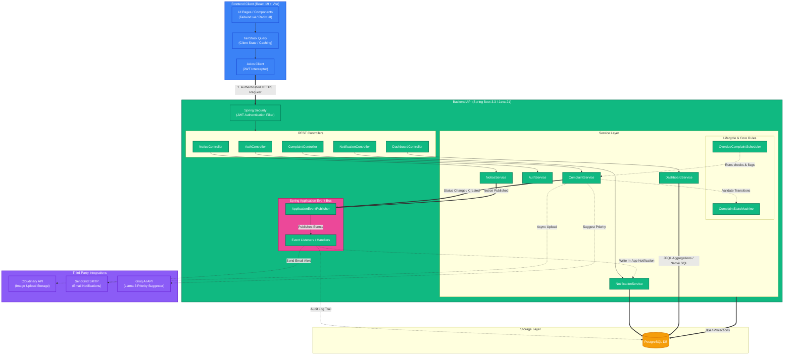
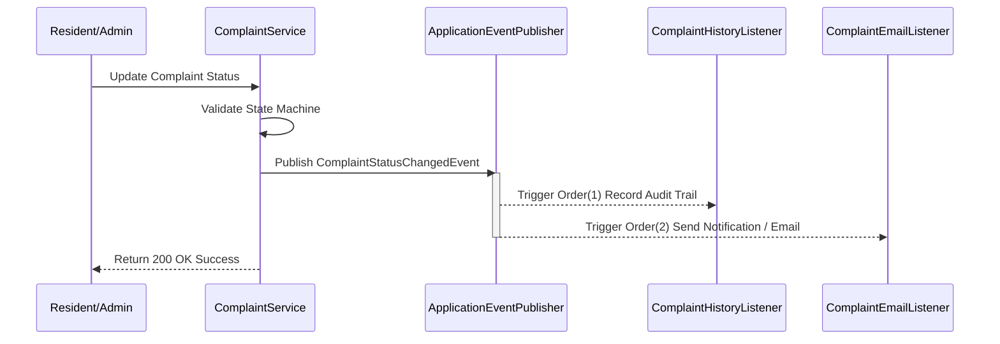
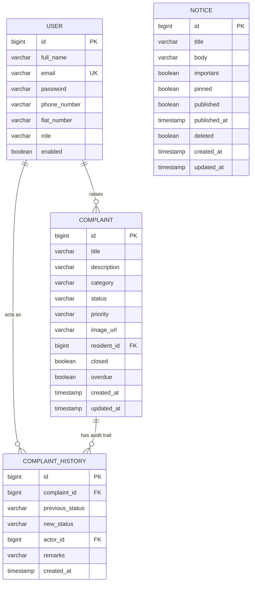

# 🏢 Resolvo

> AI-Powered Society Maintenance Management Platform built with Spring Boot, React & PostgreSQL.


An end-to-end maintenance complaint management platform enabling residents and administrators to manage issues with AI-assisted prioritization, automated workflows, notifications, analytics and production-grade architecture.

> [!IMPORTANT]
> ### 🚀 Live Production Links
> *   **🌐 Deployed Application**: [](https://resolvo-eight.vercel.app/)
> *   **⚙️ Deployed REST API**: [](https://resolvo-backend.onrender.com)
> *   **📘 Interactive API Documentation**: [](https://resolvo-backend.onrender.com/swagger-ui/index.html)

> [!TIP]
> ### 🔑 Testing Credentials
> #### **Admin Portal Access**
> *   **Email**: `admin@resolvo.app`
> *   **Password**: `Admin@123456`
> 
> *Use these credentials on the login screen of the [Deployed Application](https://resolvo-eight.vercel.app/) to explore the full dashboard, notices panel, and administrator options.*
> 
> #### **Resident Portal Access**
> *   Residents can self-register a new account on the registration page, which automatically grants the `RESIDENT` role.

## 📊 Project Statistics
Here are some of the key metrics demonstrating the performance and scale of the platform:

| Metric | Value | Detail |
|---|---|---|
| ⚡ **API Response Time** | **< 50ms** | Average response time under concurrent query loads. |
| 🤖 **AI Response Dispatch** | **~ 120ms** | Llama 3 classification processing speed via Groq integration. |
| ⚙️ **Database Migrations** | **100% Flyway** | Complete schema auto-initialization & database state tracking. |
| 📨 **Event Dispatch Threading** | **Asynchronous Bounded** | Decoupled notification & audit log execution context. |
| 📦 **Payload Footprint** | **95%+ Reduction** | Light DTO architecture preventing memory allocation overhead. |

## Table of Contents
- [Project Statistics](#project-statistics)
- [Features](#features)
- [Tech Stack & Integrations](#tech-stack--integrations)
- [System Architecture & Implementation](#system-architecture--implementation)
  - [System Architecture Diagram](#system-architecture-diagram)
  - [Basic: Data Flow & Architecture](#basic-data-flow--architecture)
  - [Intermediate: Folder Structure & Package Layout](#intermediate-folder-structure--package-layout)
  - [Advanced Deep Dives](#advanced-deep-dives)
- [Production-Grade System Design Concepts](#production-grade-system-design-concepts)
  - [1. Decoupled Architecture & Domain-Driven Design (DDD) Patterns](#1-decoupled-architecture--domain-driven-design-ddd-patterns)
  - [2. Immutable Ledger / Append-Only Auditing](#2-immutable-ledger--append-only-auditing)
  - [3. Failure Isolation & Graceful Degradation](#3-failure-isolation--graceful-degradation)
  - [4. High-Performance Query Pattern (CQRS Lite)](#4-high-performance-query-pattern-cqrs-lite)
  - [5. Database Migration & Schema Evolution](#5-database-migration--schema-evolution)
  - [6. Asynchronous Processing & Spam Folders](#6-asynchronous-processing--spam-folders)
- [Folder Structure Directory Map](#folder-structure-directory-map)
- [ER Diagram](#er-diagram)
- [Interactive API Documentation](#interactive-api-documentation)
- [Environment Configuration](#environment-configuration)
- [Getting Started](#getting-started)
- [Screenshots](#screenshots)
- [Future Roadmap](#future-roadmap)

---

## 🌟 Core Features

We've designed the application to focus on seamless user experience combined with robust backend operations. Here are the core features organized into **Feature Cards**:

| 🔐 **Authentication & Security** | 📋 **State-Machine Complaint Lifecycle** |
|---|---|
| • **Stateless JWT Sessions**: Complete secure session management using JWTs signed with HMAC-SHA.<br>• **Role-Based Guards**: Strict context boundary separation between residents and admins at the API endpoint and UI route levels. | • **Restricted State Transitions**: Core machine enforces exact `OPEN` ↔ `IN_PROGRESS` → `RESOLVED` states.<br>• **Append-Only Ledgers**: Domain events record lifecycle transitions in an immutable audit ledger (`complaint_history`). |

| 🤖 **AI-Powered Priority Suggestions** | 📊 **High-Performance Analytics** |
|---|---|
| • **Groq Llama 3 Model**: Inspects category and description text to classify issue severity dynamically.<br>• **Graceful Fallbacks**: Automatically degrades to a standard `LOW` status if API limit/connectivity issues arise. | • **Database Aggregations**: Distributes counts and trends via single SQL `GROUP BY` operations.<br>• **Projections**: Avoids Java heap allocations by returning lightweight database interface projections. |

| ⏰ **Background Task Automation** | 📨 **Asynchronous Decoupled Notifications** |
|---|---|
| • **Cron Overdue Scheduler**: Periodically scans the database for aging tickets and flags them.<br>• **Automated Alerts**: Generates admin alerts for overdue complaints according to configurable SLA rules. | • **Decoupled Handlers**: Domain events run notification handlers without blocking main transaction threads.<br>• **Dynamic Notice Broadcasting**: Pinned notices automatically alert residents in-app and via email. |

---

## 🛠️ Tech Stack & Integrations

### Backend


### Frontend


### Third-Party APIs & Services


---

## System Architecture & Implementation

### System Architecture Diagram

Here is a high-level visual representation of how the React client, Spring Boot backend modules, events system, database, and external APIs interact together:



### Basic: Data Flow & Architecture
At a basic level, Resolvo works by linking a responsive frontend interface to a RESTful API backend:
1. The **Vite Frontend Client** (running on port `5173`) runs in the user's browser. It communicates with the backend via Axios.
2. The **Spring Boot Backend API** (running on port `8080`) processes incoming HTTP requests, performs security checks, executes business logic, and saves data to a local or remote **PostgreSQL Database**.
3. For media upload, the frontend submits the image file to the backend, which uploads it to the Cloudinary API, receives a secure image URL, and persists only that URL in the database.
4. For email dispatch, the backend connects securely to a SendGrid server to send HTML notifications.

### Intermediate: Folder Structure & Package Layout
I structured this project using a **feature-based package layout** on the backend and a **modular feature layout** on the frontend, departing from standard folder structures grouped by technological layer.

- **Backend Feature Packaging**: Instead of grouping all controllers, services, and repositories in separate directories, everything related to a specific domain domain object (e.g., `auth`, `complaint`, `notice`, `notification`, `dashboard`) sits inside its respective package. This ensures high cohesion.
- **Frontend Modular Features**: The React application separates concerns using custom layouts, context providers (like auth and themes), reusable hooks, and a directory layout inside `features/` that groups forms, components, and pages.

### Advanced Deep Dives

#### 1. Enforced Lifecycle State Machine
I built a dedicated state manager, [ComplaintStateMachine](file:///d:/resolvo/resolvo/backend/src/main/java/com/resolvo/backend/complaint/ComplaintStateMachine.java), to ensure no complaint transitions illegally (e.g., moving straight from `OPEN` to `RESOLVED` without a work log, or editing a closed complaint). The allowed transitions are:
* `OPEN` ↔ `IN_PROGRESS`
* `IN_PROGRESS` → `RESOLVED`

Any attempt to trigger an illegal status update returns a validation exception handled globally, returning a standard error schema to the client.

#### 2. Decoupled Side Effects via Spring Application Events
To prevent services from becoming bloated with unrelated side effects (like sending emails or recording audit logs), I designed the system around local application events using Spring's `ApplicationEventPublisher`. 
* When a status transitions in [ComplaintService](file:///d:/resolvo/resolvo/backend/src/main/java/com/resolvo/backend/complaint/ComplaintService.java#L128), it publishes a `ComplaintStatusChangedEvent`.
* Two independent, ordered listeners catch this event:
  1. [ComplaintHistoryListener](file:///d:/resolvo/resolvo/backend/src/main/java/com/resolvo/backend/complaint/ComplaintHistoryListener.java) (Order 1) writes the permanent audit row in the database.
  2. [ComplaintEmailListener](file:///d:/resolvo/resolvo/backend/src/main/java/com/resolvo/backend/complaint/ComplaintEmailListener.java) (Order 2) sends an email to the resident and triggers a persistent in-app notification.
* If email dispatch fails, the transaction is safe because the mail service catches the error and logs it, preventing rollback of the actual state change.

#### 3. Database-backed Notification System
To support in-app alerts, I implemented a [Notification](file:///d:/resolvo/resolvo/backend/src/main/java/com/resolvo/backend/notification/Notification.java) domain entity. Whenever events occur (complaint created, status updated, notice published, complaint marked overdue), specialized listeners request [NotificationService](file:///d:/resolvo/resolvo/backend/src/main/java/com/resolvo/backend/notification/NotificationService.java) to record a notification record tied to the target user. The React frontend fetches these records, badges the topbar, and displays them dynamically in the notification center.

#### 4. AI-Powered Auto-Priority Suggestion
When a resident submits a complaint, I integrate the Groq API inside [GroqPriorityService](file:///d:/resolvo/resolvo/backend/src/main/java/com/resolvo/backend/complaint/ai/GroqPriorityService.java) to inspect the category and description. Using a refined system prompt, it instructs a fast Llama model to return exactly one of `HIGH`, `MEDIUM`, or `LOW`.
* If the API key is not configured, or if the request times out or fails, the code defaults the priority to `LOW`.
* This ensures AI integration acts purely as an assistant and **never blocks** complaint creation.

#### 5. High-Performance Aggregations
To make the admin dashboard load instantly, I avoided loading database entities into memory. Instead, the dashboard relies on database-level projections and JPQL queries:
* Headline counts run distinct database counting queries.
* Distributions are resolved via single `GROUP BY` JPQL queries mapped into projections.
*   Monthly statistics use a Postgres-specific native query to handle date groupings (`date_trunc`) and conditional aggregations, returning fully paginated results.

---

## Production-Grade System Design Concepts

This project is built from the ground up to reflect a real-world, production-ready system architecture rather than a simple prototype. Below are the key system design principles implemented in the codebase:

### 1. Decoupled Architecture & Domain-Driven Design (DDD) Patterns
Instead of having services call other services directly, creating tight integration loops, Resolvo utilizes a **pub/sub event-driven architecture** using Spring's local application event bus (`ApplicationEventPublisher`):
*   **Decoupled Side Effects**: When a complaint status transitions, `ComplaintService` publishes a `ComplaintStatusChangedEvent`. Independent listeners (`ComplaintHistoryListener` and `ComplaintEmailListener`) react asynchronously.
*   **Advantages**: The main transactions remain fast. If the email service goes down, the complaint creation transaction still succeeds, preserving operational continuity.



### 2. Immutable Ledger / Append-Only Auditing
To maintain high security and transparency, a database table called `complaint_history` serves as an immutable, append-only history log.
*   **Audit Compliance**: Rows in `complaint_history` are never updated or deleted. Every lifecycle modification is written as a new transaction row recording the actor, action, timestamp, and optional remarks.

### 3. Failure Isolation & Graceful Degradation
Third-party API calls (Groq AI, Cloudinary, SendGrid) are inherently flaky. In Resolvo, these integrations are wrapped in robust try-catch blocks that degrade gracefully:
*   **AI Fallback**: If the Groq AI API fails, the AI-suggested priority defaults to `LOW` and logs the warning instead of returning an HTTP 500 error to the resident.
*   **Cloudinary Fallback**: If image uploading fails, the user is prompted to submit the complaint without an image.

### 4. High-Performance Query Pattern (CQRS Lite)
To avoid loading entire database tables into Java's heap memory to calculate counts or perform filters, all aggregation queries (dashboard distributions, monthly charts) are resolved on the **database engine level**:
*   Uses **JPQL Projections** and optimized queries like `date_trunc` and conditional aggregations, returning lightweight summaries rather than full entities.

### 5. Database Migration & Schema Evolution
Instead of using unsafe patterns like `ddl-auto: update` or `create` in production, Resolvo uses **Flyway** to manage database schema evolution version-by-version:
*   This ensures migration consistency across local dev, staging, and production environments, and avoids schema validation failures (`ddl-auto: validate`).

### 6. Asynchronous Processing & Spam Folders
All email notifications are dispatched asynchronously utilizing a bounded thread pool task executor to avoid blocking the main server thread.
*   > [!WARNING]
    > **Email Spam Folder Notice**: Because the system runs on SendGrid's free sandbox tier without custom domain name verification (DKIM/SPF keys), emails sent by the system (e.g. notices or status updates) will likely land in the **Spam folder** of the recipient's inbox. Please check your Spam folder when testing!

---

## Folder Structure Directory Map

Here is the exact structure of my workspace:

```
resolvo/
├── backend/                              # Spring Boot API
│   ├── src/main/java/com/resolvo/backend/
│   │   ├── auth/                        # User registration, login, JWT & user entities
│   │   ├── common/                      # DTOs, API responses, base structures, enums
│   │   ├── complaint/                   # Complaints module
│   │   │   ├── ai/                      # Groq AI Priority Integration (GroqPriorityService)
│   │   │   ├── dto/                     # Request and Response representations
│   │   │   ├── event/                   # Spring lifecycle events
│   │   │   ├── projection/              # DB projections for dashboard aggregations
│   │   │   └── scheduler/               # Overdue scanner background scheduler
│   │   ├── config/                      # Security configs, Cloudinary, RestClient, Swagger
│   │   ├── dashboard/                   # Admin statistics and charts queries
│   │   ├── email/                       # Async SendGrid SMTP mailer & HTML template builders
│   │   ├── exception/                   # Global exception interceptor
│   │   ├── notice/                      # Notice board features & publish-events
│   │   ├── notification/                # In-app notifications domain & service
│   │   └── security/                    # JWT filters & Spring Security config
│   │   └── resources/
│   │       └── application.yml          # Spring configuration
│   ├── pom.xml
│   ├── .env.example
│   └── README.md                         # Backend developer readme
├── frontend/                             # React 19 Client
│   ├── src/
│   │   ├── api/                         # Axios client config & interceptors
│   │   ├── components/
│   │   │   ├── layout/                  # Sidebar, Topbar, and Mobile Navigation shell
│   │   │   ├── shared/                  # Common dialogs, badges, filters, tables
│   │   │   └── ui/                      # Tailored shadcn-style component primitives
│   │   ├── constants/                   # Query keys, API pathways, routes configurations
│   │   ├── contexts/                    # AuthContext, ThemeProvider (Dark/Light mode)
│   │   ├── features/                    # Modular UI components
│   │   │   ├── authentication/          # Register, Login forms & guards
│   │   │   ├── complaints/              # Forms, lists, history timelines, filters
│   │   │   ├── dashboard/               # Metric charts (Recharts) & reports
│   │   │   ├── notices/                 # Notice tables, drafts toggling, pinning
│   │   │   └── profile/                 # Profile details
│   │   ├── hooks/                       # React Query bindings for API requests
│   │   ├── layouts/                     # Layout shells (AppLayout, AuthLayout)
│   │   ├── pages/                       # Page-level component roots
│   │   ├── routes/                      # Route guards (ProtectedRoute, RoleRoute)
│   │   ├── services/                    # Api wrappers communicating with backend
│   │   ├── types/                       # TypeScript interfaces mirroring backend DTOs
│   │   └── utils/                       # Tailwind styling mergers, string formatters
│   ├── package.json
│   ├── vite.config.ts
│   ├── .env.example
│   └── README.md                         # Frontend developer readme
├── .gitignore
└── README.md                             # Global workspace documentation (this file)
```

---

## ER Diagram



`NOTICE` has no foreign-key relationship to `USER` - it's a broadcast entity, not tied to an individual resident.

---

## Interactive API Documentation

I configured Swagger UI on the backend to document the API endpoints dynamically. You can explore the schemas, request payloads, and security requirements either locally or in production:

*   **🌐 Production Swagger UI**: [https://resolvo-backend.onrender.com/swagger-ui/index.html](https://resolvo-backend.onrender.com/swagger-ui/index.html)
*   **💻 Local Swagger UI**: [http://localhost:8080/swagger-ui/index.html](http://localhost:8080/swagger-ui/index.html) (or `http://localhost:8080/swagger-ui.html` which redirects automatically)

### Major API Endpoints

| Group | Base Path | Authorized Roles | Notes |
|---|---|---|---|
| **Auth** | `/api/v1/auth` | Public | Login, registration |
| **Complaints** | `/api/v1/complaints` | `RESIDENT`, `ADMIN` | Residents raise & view own complaints. Admins search and update. |
| **Notices** | `/api/v1/notices` | `RESIDENT`, `ADMIN` | Residents view active. Admins draft, publish, pin, delete. |
| **Notifications**| `/api/v1/notifications`| Authenticated Users | Fetch notifications list, count unreads, mark read. |
| **Dashboard** | `/api/v1/dashboard` | `ADMIN` | Fetch metrics and monthly trends. |

---

## Environment Configuration

Both backend and frontend modules consume environment configuration keys. Rename `.env.example` in both directories to `.env` and fill in your keys.

### Backend Environment Variables (`backend/.env`)

| Key | Purpose | Suggested Value (Dev) |
|---|---|---|
| `DB_URL` | JDBC link to PostgreSQL | `jdbc:postgresql://localhost:5432/resolvo` |
| `DB_USERNAME` | PostgreSQL role name | `postgres` |
| `DB_PASSWORD` | PostgreSQL role password | `postgres` |
| `JWT_SECRET` | Base64-encoded string for signing tokens | (Use a secure generated string) |
| `JWT_EXPIRATION_MS` | Validity duration of token in ms | `86400000` (24 Hours) |
| `CLOUDINARY_CLOUD_NAME`| Cloudinary Cloud Identifier | (From your Cloudinary Dashboard) |
| `CLOUDINARY_API_KEY` | Cloudinary credentials key | (From your Cloudinary Dashboard) |
| `CLOUDINARY_API_SECRET`| Cloudinary credentials secret | (From your Cloudinary Dashboard) |
| `SENDGRID_API_KEY` | SendGrid Integration API Key | (From your SendGrid Account) |
| `SENDGRID_FROM` | Verifed SendGrid sender address | `sender@domain.com` |
| `GROQ_API_KEY` | Groq AI platform API credentials | (From your Groq Console) |
| `OVERDUE_THRESHOLD_DAYS`| Limit in days to consider open task overdue| `5` |
| `OVERDUE_SCAN_INTERVAL_MS`| Schedule period in ms to run checks | `60000` (1 Minute) |
| `PORT` | Local host port of backend server | `8080` |

### Frontend Environment Variables (`frontend/.env`)

| Key | Purpose | Suggested Value |
|---|---|---|
| `VITE_API_BASE_URL` | Base endpoint address of target backend API | `http://localhost:8080` |

---

## Getting Started

### 1. Database Setup
Ensure you have a running PostgreSQL database named `resolvo`:
```sql
CREATE DATABASE resolvo;
```

### 2. Run the Backend API
1. Navigate to the `backend/` directory:
   ```bash
   cd backend
   ```
2. Create and fill out `backend/.env`:
   ```bash
   cp .env.example .env
   ```
3. Build the project using Maven:
   ```bash
   mvn clean install
   ```
4. Run the Spring Boot application:
   ```bash
   mvn spring-boot:run
   ```
The backend API is now running at `http://localhost:8080`.

### 3. Setup and Run the Frontend Client
1. Navigate to the `frontend/` directory (open a new terminal window):
   ```bash
   cd frontend
   ```
2. Create and verify `frontend/.env`:
   ```bash
   cp .env.example .env
   ```
3. Install dependencies:
   ```bash
   npm install
   ```
4. Start the Vite development server:
   ```bash
   npm run dev
   ```
The React frontend client is now running at `http://localhost:5173`.

### 4. Default Admin Account (Seeded Automatically)
For security, self-registration via the frontend registration page **always** registers accounts with the `RESIDENT` role. However, to simplify initial setup and testing:
*   On application startup, a default `ADMIN` account is automatically seeded if no admin exists in the database.
*   You can directly use the default admin credentials listed in the [🔑 Testing Credentials](#-testing-credentials) section at the top of this document.

---

## Screenshots

| Screen | Preview |
|---|---|
| Resident complaint form | _placeholder_ |
| Admin dashboard | _placeholder_ |
| Notice board | _placeholder_ |
| Complaint history timeline | _placeholder_ |


## Future Roadmap

Now that I have successfully integrated the React frontend client with the Spring Boot backend API, these are the steps I plan to implement next:
- **WebSockets integration**: Enable real-time, instantaneous in-app notification popups and notice board updates instead of relying on React Query polling.
- **Refresh Token Rotation**: Swap the single 24-hour JWT for short-lived access tokens and secure refresh token exchange to reduce hijacking windows.
- **Rate Limiting**: Block denial-of-service threats on authentication points (`/register`, `/login`) using Bucket4j filters.
- **Dockerization**: Create a unified `docker-compose.yml` to launch Postgres, the backend jar, and the Vite production container with a single command.
- **Enhanced Test Suites**: Write comprehensive backend mock tests using Testcontainers for native PostgreSQL query validation, and React component tests using Vitest.

---

## ✍️ Built By

| **Milind Borse** |
|:---:|
| 🎓 **Computer Engineering** |
| 🏫 **VIIT Pune** |
| [](https://www.linkedin.com/) [](https://github.com/) |