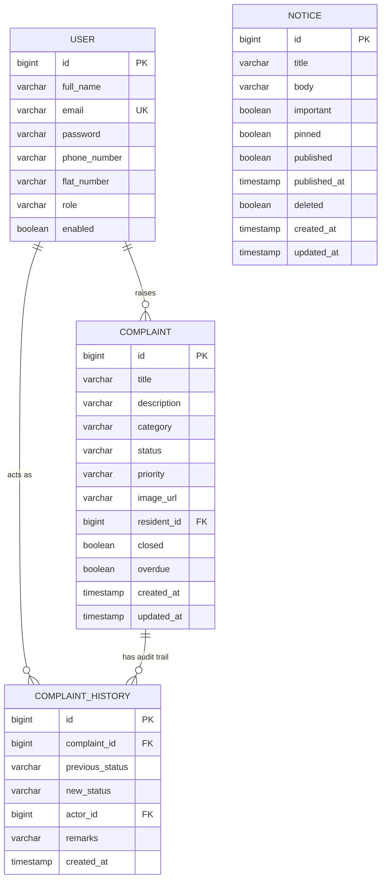

# Resolvo

**Resolvo** is a full-stack Society Maintenance Tracker. Residents raise maintenance complaints with photos and track them to resolution; admins manage the complaint lifecycle with priorities and overdue detection, run a notice board, and get real analytics on what's actually happening in the society.

This repository currently contains the **backend** (Spring Boot). The frontend (React + TypeScript) is planned next - see [Future Scope](#future-scope).

> Looking for backend implementation detail (package-by-package design notes, trade-offs, exact query behavior)? See [`backend/README.md`](./backend/README.md). This document is the project-level overview.

---

## Table of Contents
- [Features](#features)
- [Tech Stack](#tech-stack)
- [Architecture](#architecture)
- [Folder Structure](#folder-structure)
- [ER Diagram](#er-diagram)
- [API Documentation](#api-documentation)
- [Environment Variables](#environment-variables)
- [Getting Started](#getting-started)
- [Screenshots](#screenshots)
- [Future Scope](#future-scope)

---

## Features

**Auth & Access Control**
- JWT-based registration/login, role-based access (`ADMIN` / `RESIDENT`), BCrypt password hashing

**Complaint Management**
- Residents raise complaints with category, description, and an optional photo (Cloudinary)
- Enforced status lifecycle (`OPEN → IN_PROGRESS → RESOLVED`) via a real state machine, not arbitrary updates
- Append-only audit trail - every status change is permanently recorded (timestamp, actor, remarks)
- Admin priority management (`LOW` / `MEDIUM` / `HIGH`)
- Advanced admin search: status, priority, category, date range, resident name, overdue flag, and free-text keyword - all filtered in the database, never in Java
- Lightweight list DTOs vs. full detail DTOs, to keep list endpoints fast

**Automatic Overdue Detection**
- A scheduled background job (interval configurable, not hardcoded) flags complaints that cross a configurable age threshold
- Fully isolated from complaint CRUD logic - the scheduler never touches `ComplaintService`
- Publishes a domain event per newly-overdue complaint, ready for a future notification channel

**Notice Board**
- Draft → Publish lifecycle, pinned notices always sort first, soft delete (nothing is ever hard-deleted)
- Publishing an *important* notice emails every resident automatically

**Dashboard Analytics**
- Headline counts, group-by-category/priority/status, monthly trends, recent activity - every number computed by the database (aggregation queries), never counted in application memory

**Event-Driven Architecture**
- Complaint status changes and notice publishing are decoupled from their side effects (history recording, email sending) via Spring's `ApplicationEventPublisher` - no message broker needed at this scale

**Production Hardening**
- Centralized API path and role constants (no repeated string literals)
- N+1 query elimination via `@EntityGraph` / fetch-joins on every list endpoint
- Consistent error response shape across the entire API, with specific handling for common failure modes (bad sort fields, malformed JSON, wrong types, wrong HTTP verbs)
- Structured logging at every mutation point, without ever logging credentials
- `/actuator/health` for deployment monitoring

---

## Tech Stack

| Layer | Technology |
|---|---|
| Language | Java 21 |
| Framework | Spring Boot 3.3 |
| Security | Spring Security, JWT (jjwt) |
| Persistence | Spring Data JPA / Hibernate, PostgreSQL |
| Validation | Jakarta Bean Validation |
| Docs | springdoc-openapi (Swagger UI) |
| Media | Cloudinary (photo uploads) |
| Email | Spring Mail (SMTP) |
| Scheduling | Spring `@Scheduled` |
| Monitoring | Spring Boot Actuator |
| Build | Maven |
| Boilerplate reduction | Lombok |
| Planned frontend | React + TypeScript |

---

## Architecture

Resolvo follows a **feature-based, layered architecture**: each business capability (`auth`, `complaint`, `notice`, `dashboard`) is its own package containing its entity, repository, service, controller, and DTOs - rather than grouping the whole app by technical layer (all controllers together, all services together, etc). This keeps each feature cohesive and easy to reason about in isolation.

**Layering rule, enforced throughout:** Controller → Service → Repository. Controllers never talk to repositories directly, and JPA entities never cross the controller boundary - every endpoint deals exclusively in DTOs.

**Event-driven side effects.** Two flows in this codebase deliberately avoid direct service-to-service calls:
- Complaint status changes publish `ComplaintStatusChangedEvent`. Two independent listeners react: one records the audit-trail row, the other sends an email. `ComplaintService` has no reference to either.
- Notice publishing publishes `NoticePublishedEvent` (only when the notice is marked important). A listener emails every resident. `NoticeService` has no reference to `EmailService` at all.

This is what lets a future notification channel (push, SMS, Slack) get added by writing one new listener class - zero changes to the services that trigger the event.

**Background processing is isolated.** `OverdueComplaintScheduler` triggers `OverdueDetectionService`, which only depends on `ComplaintRepository` - never on `ComplaintService`. Complaint CRUD/lifecycle and background overdue scanning are two independent concerns that can evolve without touching each other.

**Every filter is pushed into the database.** The advanced complaint search endpoint composes filters via JPA Specifications (Criteria API) - nothing is ever filtered in application memory after a query returns.

For the full technical rationale behind each of these decisions (including documented trade-offs), see [`backend/README.md`](./backend/README.md).

---

## Folder Structure

```
resolvo/
├── backend/
│   ├── src/main/java/com/resolvo/backend/
│   │   ├── auth/              # registration, login, User entity, JWT issuing
│   │   ├── complaint/         # Complaint + ComplaintHistory, state machine,
│   │   │   ├── dto/           #   overdue detection, advanced search
│   │   │   ├── event/
│   │   │   ├── projection/    # aggregation-query projections for dashboard
│   │   │   └── scheduler/
│   │   ├── notice/            # notice board: draft/publish/pin/soft-delete
│   │   │   └── dto/
│   │   ├── dashboard/         # admin analytics
│   │   │   └── dto/
│   │   ├── email/             # async email sending + HTML templates
│   │   ├── security/          # JWT filter, UserDetails wiring
│   │   ├── config/            # SecurityConfig, SwaggerConfig, CloudinaryConfig
│   │   ├── common/
│   │   │   ├── constants/     # ApiPaths, SecurityRoles - no hardcoded literals
│   │   │   ├── dto/           # ApiResponse, PageResponse
│   │   │   └── enums/
│   │   └── exception/         # GlobalExceptionHandler, custom exceptions
│   │   └── resources/
│   │       └── application.yml
│   ├── pom.xml
│   ├── .env.example
│   └── README.md               # backend-specific technical documentation
├── frontend/                   # planned - React + TypeScript
├── database/                   # planned - schema exports, seed scripts
├── .gitignore
└── README.md                   # this file
```

---

## ER Diagram



`NOTICE` has no foreign-key relationship to `USER` - it's a broadcast entity, not tied to an individual resident.

---

## API Documentation

Full interactive documentation is generated automatically via Swagger UI once the backend is running:

```
http://localhost:8080/swagger-ui.html
```

Every endpoint - request/response schemas, required roles, and example payloads - is documented there directly from the code, so it can never drift out of sync with what's actually deployed. A quick summary of the major endpoint groups:

| Group | Base path | Notes |
|---|---|---|
| Auth | `/api/v1/auth` | Public - register, login |
| Complaints | `/api/v1/complaints` | Create, list (own or admin search), detail, history, status/priority updates |
| Notices | `/api/v1/notices` | Draft/publish/pin/soft-delete lifecycle, public board view |
| Dashboard | `/api/v1/dashboard` | Admin-only analytics: summary, group-bys, monthly trends, recent activity |

See [`backend/README.md`](./backend/README.md#api-summary) for the complete endpoint table with roles and behavior notes.

---

## Environment Variables

All variables live in `backend/.env.example` - copy it to `backend/.env` and fill in real values before running.

| Variable | Purpose | Default |
|---|---|---|
| `DB_URL`, `DB_USERNAME`, `DB_PASSWORD` | PostgreSQL connection | local Postgres |
| `DB_POOL_MAX_SIZE`, `DB_POOL_MIN_IDLE` | HikariCP pool tuning | `10` / `2` |
| `JWT_SECRET` | JWT signing key - **must** be replaced before any real deployment | placeholder |
| `JWT_EXPIRATION_MS` | Token lifetime | `86400000` (24h) |
| `CLOUDINARY_CLOUD_NAME`, `CLOUDINARY_API_KEY`, `CLOUDINARY_API_SECRET` | Photo upload storage | none |
| `MAIL_HOST`, `MAIL_PORT`, `MAIL_USERNAME`, `MAIL_PASSWORD`, `MAIL_FROM` | SMTP for notifications | Gmail SMTP shape |
| `OVERDUE_THRESHOLD_DAYS` | Days before an open complaint is flagged overdue | `5` |
| `OVERDUE_SCAN_INTERVAL_MS` | How often the overdue scheduler runs | `3600000` (1h) |
| `PORT` | Server port | `8080` |

---

## Getting Started

```bash
cd backend
cp .env.example .env      # fill in real DB/JWT/Cloudinary/SMTP values
mvn clean install
mvn spring-boot:run
```

Then open `http://localhost:8080/swagger-ui.html` to explore and test every endpoint interactively.

Health check (for deployment platforms like Render): `GET /actuator/health`

---

## Screenshots

_Add screenshots here once the frontend is built - e.g. resident complaint form, admin dashboard, notice board._

| Screen | Preview |
|---|---|
| Resident complaint form | _placeholder_ |
| Admin dashboard | _placeholder_ |
| Notice board | _placeholder_ |
| Complaint history timeline | _placeholder_ |

---

## Future Scope

- **Frontend** - React + TypeScript client covering resident and admin flows, deployed to Vercel
- **Real-time updates** - WebSocket push for complaint status changes and new notices, instead of polling
- **Notification channels beyond email** - push/SMS, plugging into the existing `ComplaintOverdueEvent` / `NoticePublishedEvent` listeners without touching business logic
- **Refresh tokens** - short-lived access tokens + refresh token rotation, instead of a single 24h JWT
- **Rate limiting** - particularly on `/auth/login` and `/auth/register`
- **Bulk overdue updates at scale** - if complaint volume grows significantly, revisit `OverdueDetectionService`'s per-row update in favor of a bulk `UPDATE` with a follow-up "which rows changed" query
- **CI/CD** - automated build + test pipeline (GitHub Actions), currently run manually
- **Dockerization** - containerized backend + Postgres for one-command local setup
- **Test coverage** - unit tests for the state machine and specifications, integration tests against a real Postgres via Testcontainers (the native `monthly-stats` query is Postgres-specific and won't run against H2)